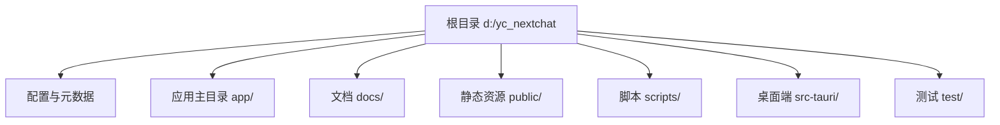
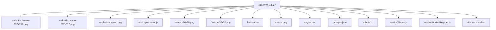
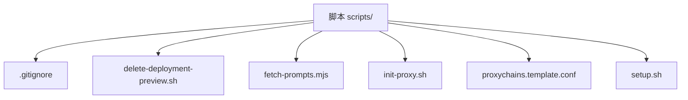
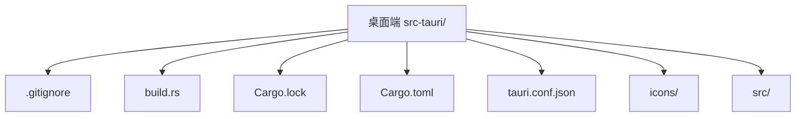
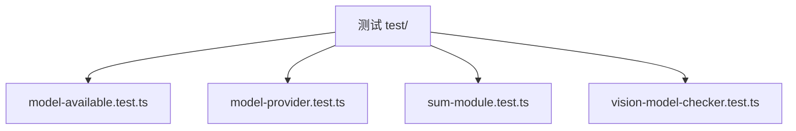

## 项目结构图（分块展示，适合用Mermaid在线工具或 VSCode 插件可视化）
## 主要目录与说明已注释，细节可根据需要扩展

### 1. 总览（一级目录结构）

---

### 2. 配置与元数据

```mermaid
graph TD
  B[配置与元数据]
  B1[.babelrc]
  B2[.dockerignore]
  B3[.env.template]
  B4[.eslintrc.json]
  B5[.gitignore]
  B6[.gitpod.yml]
  B7[.lintstagedrc.json]
  B8[.prettierrc.js]
  B9[LICENSE]
  B10[README.md]
  B11[package.json]
  B12[tsconfig.json]
  B13[vercel.json]
  B14[docker-compose.yml]
  B15[Dockerfile]
  B16[next.config.mjs]
  B17[jest.config.ts]
  B18[jest.setup.ts]
  B19[CODE_OF_CONDUCT.md]
  B20[package-lock.json]
  B21[yarn.lock]
  B --> B1
  B --> B2
  B --> B3
  B --> B4
  B --> B5
  B --> B6
  B --> B7
  B --> B8
  B --> B9
  B --> B10
  B --> B11
  B --> B12
  B --> B13
  B --> B14
  B --> B15
  B --> B16
  B --> B17
  B --> B18
  B --> B19
  B --> B20
  B --> B21
```

---

### 3. 应用主目录 app/

```mermaid
graph TD
  C[应用主目录 app/]
  C1[command.ts]
  C2[constant.ts]
  C3[global.d.ts]
  C4[layout.tsx]
  C5[page.tsx]
  C6[polyfill.ts]
  C7[typing.ts]
  C8[utils.ts]
  C9[api/]
  C10[client/]
  C11[components/]
  C12[config/]
  C13[icons/]
  C14[lib/]
  C15[locales/]
  C16[masks/]
  C17[mcp/]
  C18[model_servers/]
  C19[store/]
  C20[styles/]
  C21[utils/]
  C --> C1
  C --> C2
  C --> C3
  C --> C4
  C --> C5
  C --> C6
  C --> C7
  C --> C8
  C --> C9
  C --> C10
  C --> C11
  C --> C12
  C --> C13
  C --> C14
  C --> C15
  C --> C16
  C --> C17
  C --> C18
  C --> C19
  C --> C20
  C --> C21
```

---

### 4. 文档 docs/

```mermaid
graph TD
  D[文档 docs/]
  D1[bt-cn.md]
  D2[cloudflare-pages-cn.md]
  D3[cloudflare-pages-en.md]
  D4[cloudflare-pages-es.md]
  D5[cloudflare-pages-ja.md]
  D6[cloudflare-pages-ko.md]
  D7[faq-cn.md]
  D8[faq-en.md]
  D9[faq-es.md]
  D10[faq-ja.md]
  D11[faq-ko.md]
  D12[synchronise-chat-logs-cn.md]
  D13[synchronise-chat-logs-en.md]
  D14[synchronise-chat-logs-es.md]
  D15[synchronise-chat-logs-ja.md]
  D16[synchronise-chat-logs-ko.md]
  D17[translation.md]
  D18[user-manual-cn.md]
  D19[vercel-cn.md]
  D20[vercel-es.md]
  D21[vercel-ja.md]
  D22[vercel-ko.md]
  D23[images/]
  D --> D1
  D --> D2
  D --> D3
  D --> D4
  D --> D5
  D --> D6
  D --> D7
  D --> D8
  D --> D9
  D --> D10
  D --> D11
  D --> D12
  D --> D13
  D --> D14
  D --> D15
  D --> D16
  D --> D17
  D --> D18
  D --> D19
  D --> D20
  D --> D21
  D --> D22
  D --> D23
```

---

### 5. 静态资源 public/

---

### 6. 脚本 scripts/

---

### 7. 桌面端 src-tauri/

---

### 8. 测试 test/

---

**结构说明：**
- 配置与元数据：项目基础配置、依赖、CI/CD、代码规范等。
- app/：主应用目录，包含前端页面、API接口、组件、配置、工具、国际化等。
- docs/：项目文档与说明。
- public/：静态资源（图片、manifest、脚本等）。
- scripts/：自动化脚本与辅助工具。
- src-tauri/：桌面端（Tauri）相关源码与配置。
- test/：自动化测试代码。
